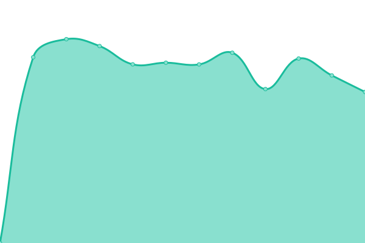
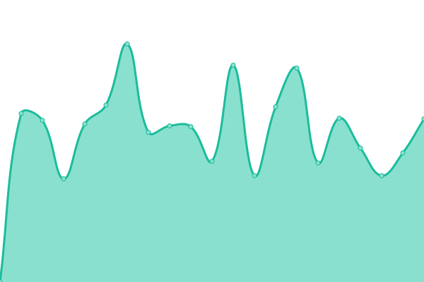

# [📈 Live Status](https://apgyorfi.github.io/szkkk-monitor): <!--live status--> **🟩 All systems operational**

This repository contains the open-source uptime monitor and status page for [Peter Gyorfi](https://apgyorfi.dev), powered by [Upptime](https://github.com/upptime/upptime).

With [Upptime](https://upptime.js.org), you can get your own unlimited and free uptime monitor and status page, powered entirely by a GitHub repository. We use [Issues](https://github.com/apgyorfi/szkkk-monitor/issues) as incident reports, [Actions](https://github.com/apgyorfi/szkkk-monitor/actions) as uptime monitors, and [Pages](https://apgyorfi.github.io/szkkk-monitor) for the status page.

<!--start: status pages-->
<!-- This summary is generated by Upptime (https://github.com/upptime/upptime) -->
<!-- Do not edit this manually, your changes will be overwritten -->
<!-- prettier-ignore -->
| URL | Status | History | Response Time | Uptime |
| --- | ------ | ------- | ------------- | ------ |
|  [Fehérvári program](https://www.fehervariprogram.hu) | 🟩 Up | [fehervari-program.yml](https://github.com/apgyorfi/szkkk-monitor/commits/HEAD/history/fehervari-program.yml) | 

 505ms
     
 | 

<a href="https://apgyorfi.github.io/szkkk-monitor/history/fehervari-program">100.00%</a>
    

|  [Lecsó jelentkezés](https://lecso.applynow.hu) | 🟩 Up | [lecso-jelentkezes.yml](https://github.com/apgyorfi/szkkk-monitor/commits/HEAD/history/lecso-jelentkezes.yml) | 

 309ms
     
 | 

<a href="https://apgyorfi.github.io/szkkk-monitor/history/lecso-jelentkezes">97.77%</a>
    

|  [Fehérvári program jegyrendszer](https://fehervariprogram.hu/jegy) | 🟩 Up | [fehervari-program-jegyrendszer.yml](https://github.com/apgyorfi/szkkk-monitor/commits/HEAD/history/fehervari-program-jegyrendszer.yml) | 

 860ms
     
 | 

<a href="https://apgyorfi.github.io/szkkk-monitor/history/fehervari-program-jegyrendszer">100.00%</a>
    

|  [Tele Élettel programportál](https://teleelettel.hu) | 🟩 Up | [tele-elettel-programportal.yml](https://github.com/apgyorfi/szkkk-monitor/commits/HEAD/history/tele-elettel-programportal.yml) | 

 10795ms
     
 | 

<a href="https://apgyorfi.github.io/szkkk-monitor/history/tele-elettel-programportal">95.42%</a>
    

|  [Barátság mozi honlap](https://baratsagmozi.hu) | 🟩 Up | [baratsag-mozi-honlap.yml](https://github.com/apgyorfi/szkkk-monitor/commits/HEAD/history/baratsag-mozi-honlap.yml) | 

 615ms
     
 | 

<a href="https://apgyorfi.github.io/szkkk-monitor/history/baratsag-mozi-honlap">99.29%</a>
    

|  [Barátság mozi jegyrendszer](https://musor.baratsagmozi.hu) | 🟩 Up | [baratsag-mozi-jegyrendszer.yml](https://github.com/apgyorfi/szkkk-monitor/commits/HEAD/history/baratsag-mozi-jegyrendszer.yml) | 

 294ms
     
 | 

<a href="https://apgyorfi.github.io/szkkk-monitor/history/baratsag-mozi-jegyrendszer">99.54%</a>
    

|  [Királyi napok](https://kiralyinapok.szekesfehervar.hu) | 🟩 Up | [kiralyi-napok.yml](https://github.com/apgyorfi/szkkk-monitor/commits/HEAD/history/kiralyi-napok.yml) | 

 230ms
     
 | 

<a href="https://apgyorfi.github.io/szkkk-monitor/history/kiralyi-napok">100.00%</a>
    

|  [Diáknapok](https://diaknapok.hu) | 🟩 Up | [diaknapok.yml](https://github.com/apgyorfi/szkkk-monitor/commits/HEAD/history/diaknapok.yml) | 

 780ms
     
 | 

<a href="https://apgyorfi.github.io/szkkk-monitor/history/diaknapok">99.43%</a>
    

<!--end: status pages-->

[**Visit our status website →**](https://apgyorfi.github.io/szkkk-monitor)

## 📄 License

- Powered by: [Upptime](https://github.com/upptime/upptime)
- Code: [MIT](./LICENSE) © [Anand Chowdhary](https://anandchowdhary.com), supported by [Pabio](https://pabio.com)
- Data in the `./history` directory: [Open Database License](https://opendatacommons.org/licenses/odbl/1-0/)
